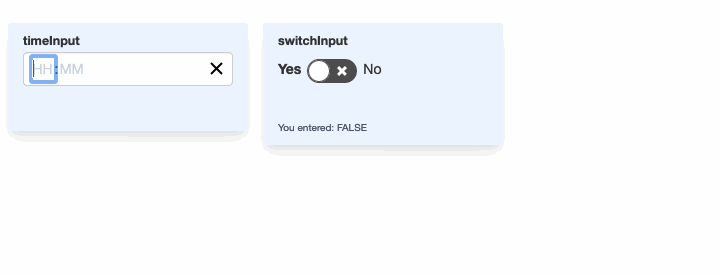

# shinieR
Shinier inputs for Shiny apps



## Installation

`devtools::install_github("xari/shinieR")`

## Usage

#### `timeInput()`

This input is a binding for [`react-time-picker`](https://github.com/wojtekmaj/react-time-picker#readme).
All props for the React component may be given as items to the `configuration` list, as shown below.

```r
timeInput(
    "timeInput",
    configuration = list(
       disableClock = TRUE,
       format = "HH:mm",
       hourPlaceholder = "HH",
       minutePlaceholder = "MM"
    )
)
```

#### `switchInput()`

This is a binding for [`react-toggle`](https://github.com/aaronshaf/react-toggle).
Like `timeInput()`, all original props can be passed to the component via the `configuration` list.

```r
switchInput("switchInput",
            c("Yes", "No"))
```
